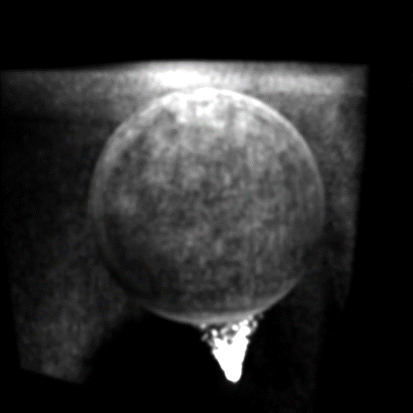
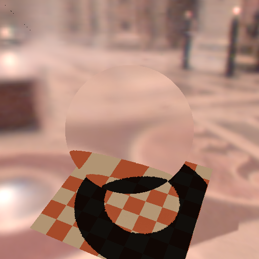
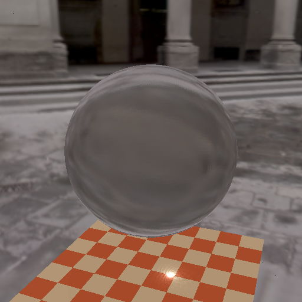
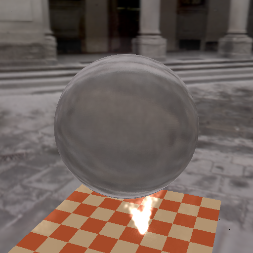

# Refractive-Object-Rendering
This is an implementation of [*Interactive Relighting of Dynamic Refractive Objects*](http://dl.acm.org/citation.cfm?id=1360634).

We implement the pipeline using DirectX and CUDA.

**The process includes 5 stages**:

1. Voxelization

2. Octree construction

3. Photon generation

4. Photon marching

5. View pass

- - -
**Here are some results:**

-*Radiance*

-*Shadow*

-*Caustic*

-*Rendering with radiance*

